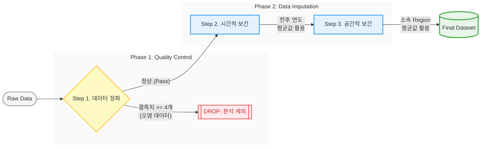

# 🎹 [그럴 수 ~ 명있지]: 술과 기대수명의 착시에서 출발해, 오래 사는 진짜 이유를 찾다.
> **"술을 많이 마시면 정말 수명이 짧아질까?"** 라는 호기심에서 시작된 WHO 데이터 EDA 프로젝트

---

## 1. 👥 팀 소개

| 성함 | GitHub |
| :---: | :---: |
| **권민제** |  |
| **문성준** |  |
| **전윤우** |  |
| **정준하** |  |
| **최하진** |  |

---

## 2. 📋 프로젝트 개요

### 💬 Project Story
“술은 건강에 좋지 않다고 하는데, 술을 많이 마시는 나라의 사람들은 실제로 어떨까?”라는  
가벼운 호기심에서 분석을 시작했습니다.

처음에는 **알코올 소비량**과 **기대수명**이 어느 한쪽으로 뚜렷한 관계를 보일 것이라 예상했지만,  
GDP가 높은 국가일수록 알코올 소비량이 많으면서도 기대수명이 높은 경우가 존재했고,
변수 간 관계는 일관되게 강한 상관관계를 보이지는 않았습니다.

이 과정에서 기대수명은 단순히 술 소비나 경제 수준만으로 설명되기 어렵고,  
**보건 환경, 교육 수준, 질병 관리, 예방접종 등 다양한 요인이 함께 얽혀 있는 지표**임을 확인했습니다.  
따라서 본 프로젝트는 WHO 기대수명 데이터를 활용해  
**사람들이 더 오래 사는 데 영향을 주는 요인(Key Factors)들이 무엇인지**를 탐색하는 것을 목표로 합니다.

### 📚 데이터 출처 (Data Sources)

| 분석 지표 | 제공 기관 | 내용 | 데이터 소스 (URL) |
| :--- | :---: | :--- | :--- |
| **메인 데이터셋** | Kaggle | Raw data | https://www.kaggle.com/datasets/ kumarajarshi/life-expectancy-who |
| **기대 수명** | WHO | 종속 변수 (Target) | https://www.who.int/data/gho/data/ indicators/indicator-details/GHO/ life-expectancy-at-birth-(years) |
| **교육 연한** | UNDP | 교육 수준 (Schooling) | https://hdr.undp.org/data-center/ documentation-and-downloads |
| **GDP (1인당)** | World Bank | 국가 경제 지표 | https://data.worldbank.org/indicator/ NY.GDP.PCAP.CD?most_recent_ year_desc=true |
| **알코올 소비량** | WHO | 성인 1인당 소비량 | https://www.who.int/data/gho/data/ indicators/indicator-details/GHO/ alcohol-recorded-per-capita-(15-) |
| **B형 간염 접종률** | WHO/UNICEF | 면역 시스템 지표 | https://www.who.int/data/gho/ data/indicators/indicator-details/GHO/hepatitis-b-(hepb3) -immunization-coverage-among-1-year-olds-(-) |
---

## 3. 🛠 기술 스택
| 분류 | Stack |
| :--- | :--- |
| **Language** |  |
| **Visualization** |   |
| **Tool** |   |
---

## 4. ⚙️ 데이터 전처리 (Preprocessing)
데이터의 무결성을 위해 `isna().sum()` 탐색 후 다음과 같은 **단계별 결측치 처리 로직**을 수립했습니다.

1. **데이터 정화**: 여러 항목에 걸쳐 결측치가 너무 많은 국가(4개 컬럼 이상 비어있는 경우)는 분석의 왜곡을 방지하기 위해 가장 먼저 분석 대상에서 제외했습니다.
2. **시간적 보간**: 한 국가의 데이터 중 세로(연도) 방향으로 비어있는 경우, 해당 컬럼의 **전후년 평균값**으로 대치했습니다.
3. **공간적 보간**: 전후 데이터가 없는 경우, 해당 국가가 속한 **지역(Region)의 평균값**을 활용하여 지역적 특성을 반영했습니다.

---

## 5. 📊 수행 결과

### 🧪 1. 상관관계 분석 (Heatmap)

* **핵심 인사이트**: 히트맵 분석 결과, 예상과 달리 **알코올 소비량은 기대수명과 유의미하게 높은 상관관계를 보이지 않았습니다.** 이는 술 소비량 자체가 수명을 결정짓는 단일 요인이 아님을 입증합니다.

### 🧬 2. PCA(주성분 분석) 및 핵심 요인 회귀 분석

### 🧬 1) PCA를 이용한 지표 통합
도메인 지식을 바탕으로 변수를 3가지 카테고리로 통합했습니다. 각 그룹의 제1주성분($PC_1$)은 원본 데이터의 정보를 매우 높은 수준으로 보존합니다.

* **Group 1: 국가 시스템 역량 (Systemic)**: `Schooling`, `GDP` (**설명력: 73.12%**)
* **Group 2: 보건 인프라 (Infrastructure)**: `Hepatitis_B`, `Polio`, `Diphtheria`, `Measles` (**설명력: 80.42%**)
* **Group 3: 생활/영양 리스크 (Lifestyle)**: `Alcohol`, `BMI`, `Thinness` (**설명력: 65.81%**)

### 📈 2) 핵심 요인 회귀 분석 (Multi-Regression)

PCA 종합 지표를 독립 변수로 활용하여 기대수명에 미치는 영향력을 산출했습니다.
* **모델 설명력 ($R^2$)**: 0.6225
* **기초 기대수명 (Intercept)**: 69.57세

| 분석 그룹 | 영향력 (Coefficient) | 해석 |
| :--- | :---: | :--- |
| **국가 시스템 (Systemic)** | **+3.2252** | 국가의 교육/경제 체급이 수명 연장의 가장 핵심적인 엔진 |
| **보건 인프라 (Infrastructure)** | **+1.9148** | 공공보건망 및 백신 인프라가 수명을 뒷받침하는 핵심 요인 |
| **생활/영양 리스크 (Lifestyle)** | **-1.0173** | 영양 부족 및 불균형은 수명을 단축시키는 주요 위협 요인 |

## 🎯 최종 결론: 수명 연장을 견인하는 핵심 동력

본 프로젝트는 WHO 데이터를 통해 기대수명에 실질적으로 기여하는 독립적 요인들을 분석하였으며, 다음과 같은 핵심 인사이트를 도출했습니다.

1. **국가 시스템(Systemic)의 강한 영향력**  
회귀 분석 결과, 교육과 경제적 수준을 포함한 '국가 시스템' 지표가 기대수명에 가장 가파른 양(+)의 기여도(+3.22)를 보였습니다. 이는 개인의 건강 관리보다 국가 차원의 지적·경제적 토대가 기대 수명에 가장 큰 영향을 끼침을 알 수 있습니다.

2. **교육(Schooling) 지표의 재발견**  
   상관관계 분석에서 확인된 교육 연한의 높은 영향력(0.72)은 교육이 단순히 지식 습득을 넘어 보건 문해력 향상, 경제적 자립, 영아 사망률 감소로 이어지는 보건 선순환 구조의 출발점임을 증명합니다.

3. **인프라와 리스크의 상호작용**  
   안정적인 보건 인프라(Infrastructure)는 수명을 지지하는 필수 요건(+1.91)인 반면, 저체중 및 영양 결핍과 같은 영양형태의 리스크(Lifestyle)는 수명을 단축시키는 주요 저해 요인(-1.01)으로 나타났습니다.

4. **종합 제언**  
   데이터는 기대수명 증진을 위해 단편적인 생활 습관 교정보다는, **국가적 차원의 교육 시스템 강화와 공공 보건 관리 역량의 고도화**에 우선순위를 두어야 한다는 통계적 근거를 제시합니다.
---

## 6. 💬 한 줄 회고
* **[권민제]**: "데이터 정제 및 분석을 통해 유의미한 지표를 발굴하고자 노력했으나, 높은 결측률로 인해 데이터의 완전한 신뢰성을 확보하는 데는 현실적인 어려움이 있었습니다. 향후에는 더 정밀한 외부 지표를 결합해서 좀 더 새로운 결과를 알아보고 싶습니다."
* **[문성준]**: "eda를 진행할때 pca를 통해 요인별 대표 점수를 도출했었다. 그러나 이후 계산에서 실제로는 요인을 대표할만한 설득력을 갖지 못한다는것을 발견했다. 이번엔 요인의 요소(컬럼)를 몇개 제거하거나 수정하여 이를 보완했지만, 다음에는 분석을 먼저 진행한 후에 요인을 나누는게 오히려 논리적으로 맞는 순서라는 생각을 하였다."
* **[전윤우]**: "데이터를 전처리할 때 해당 데이터가 이상치와 결측치가 많아 처리하는 데 있어 기준을 세우는 것이 쉽지 않았으나, 고민의 과정을 거쳐 최적의 방법으로 처리하였다는 점은 잘한 포인트였습니다. 그러나, 사용한 데이터로 적용할 수 있고 인사이트를 도출할 수 있는 시각화와 통계분석을 하는 것이 쉽지 않았고 이런 부분에서 생각했던 것만큼의 결과를 내지 못해 여러모로 아쉬웠습니다. 다음에 프로젝트를 할 때는 좀 더 다양한 방법의 데이터 분석 방법론을 탐색하여 좋은 퀄리티로 낼 수 있도록 할 것입니다."
* **[정준하]**: " 이전에는 전처리 자체에 집중했다면, 이번에는 LabelEncoder, boxplot, 상관계수, 히트맵, 시계열 분석을 단계적으로 연결하며 데이터 해석 흐름을 직접 구성해 보았다.
Region별 박스플롯과 상관분석은 큰 결론을 주진 않았지만, 의미 없는 분석도 검증 과정의 일부임을 체감하는 계기가 되었다.
특히 아프리카 기대수명 증가를 GDP가 아닌 백신 접종률 시계열과 연관 지어 해석하면서, 시각화가 가설 생성으로 이어질 수 있음을 배웠다."
* **[최하진]**: "알코올 소비량과 기대수명의 상관관계를 가설로 설정했지만, 실제 분석과정에서 GDP 등 단순한 연관성을 찾기 어렵다는 한계를 경험했다. 이 과정에서 단일 지표만으로 결과를 해석하는 데 한계가 있다는 점을 알게되었고, 데이터를 더 넓은 시야로 바라볼 수 있었다."
